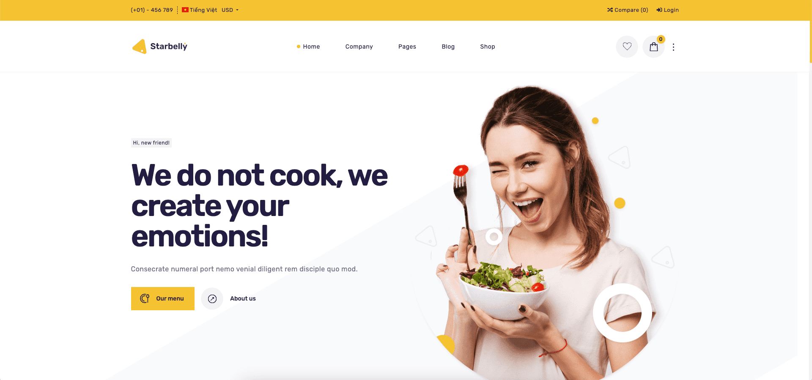

# Starbelly - Multipurpose Laravel Restaurant System

## Introduction

Starbelly is a Multipurpose Restaurant System using Laravel 9.x. It's a product built on Botble CMS.

By: [Archi Elite](https://archielite.com)

Email: [contact@archielite.com](mailto:contact@archielite.com)

Thank you for purchasing this product. If you have any questions that are beyond the scope of this help file,
please feel free to email via my user page contact form [here](https://codecanyon.net.net/user/archielite) for quickly support. Thank you so much!

## Purchase

We're selling our products in Envato, you can purchase **Starbelly** at [here](https://1.envato.market/VmaNWa).

## Demo

Homepage: [starbelly.archielite.com](https://starbelly.archielite.com)

Admin Area: [starbelly.archielite.com/admin](https://starbelly.archielite.com/admin) (**admin** - **12345678**)

## Features

- Fully Ecommerce features: product catalog, product attributes, product variations, product collections, discounts, shipping…
- Sell Simple or Variable Products
- Built-in Order Tracking page
- Unlimited Categories & Sub-Categories
- Filter Products (eg by size, color, brands, categories, etc.)
- Optional Wishlist & Compare
- Product Deals
- Gallery lightbox for product images
- Color, Label, and Image Swatches
- Product Quick View
- Frequently Bought Together
- Advanced Typography
- Single checkout page
- Support many payment methods: PayPal, Stripe, Paystack, Razorpay, Mollie and SSLCommerz.
- Guest checkout supported.
- Multi-vendor & Marketplace: easy to enable/disable multi-vendor features.
- Multi-language, unlimited languages support.
- Multi-currency, unlimited currencies support.
- Full RTL support.
- Page, blog, menu, contact, newsletter, slider… modules are provided with the use of components to avoid boilerplate code.
- Powerful media system, also support Amazon S3, DigitalOcean Spaces
- SEO & sitemap support: access [sitemap.xml](https://starbelly.archielite.com/sitemap.xml) to see more.
- Google Analytics: display analytics data in admin panel.
- Translation tool: easy to translate front theme and admin panel to your language.
- Beautiful theme is ready to use.
- Powerful Permission System: Manage user, team, role by permissions. Easy to manage user by permissions.
- Admin template comes with color schemes to match your taste.
- Fully Responsive: Compatible with all screen resolutions.
- Coding Standard: All code follow coding standards PSR-2 and best practices.

## Archi Elite Team

Visit us at [archielite.com](https://archielite.com)
