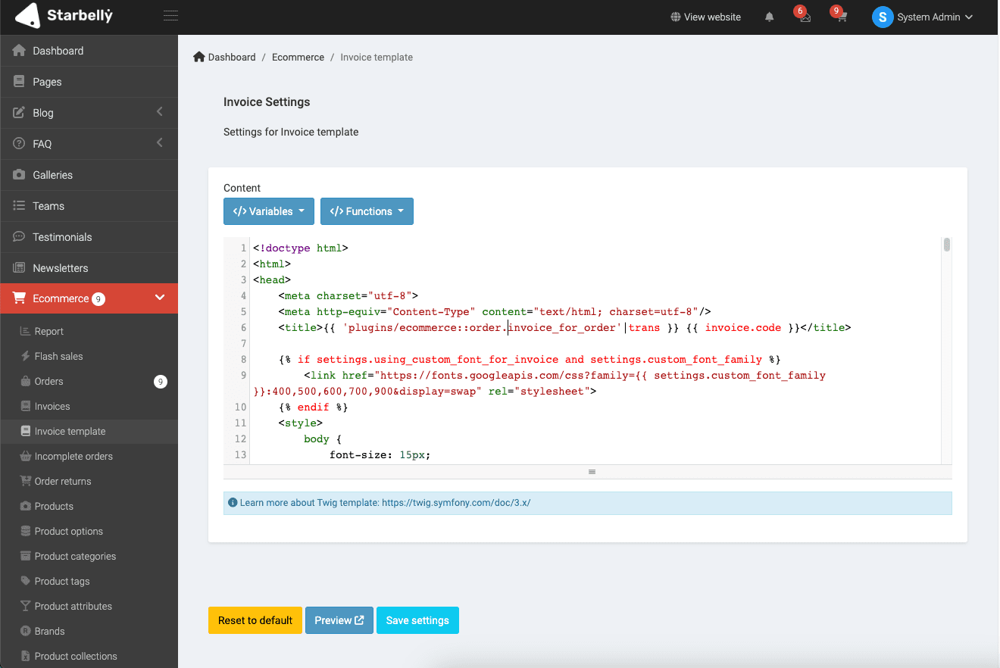
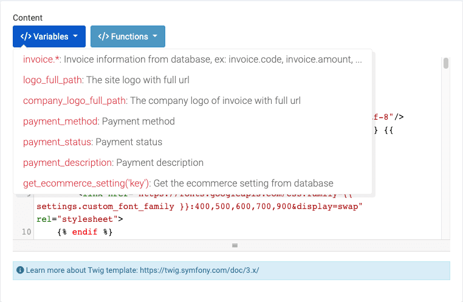

# Invoice template

**Invoice template** is a feature that allow you to customize your own template by editing directly the code in admin or in file.

:::tip INFO
You can see this feature in **Admin** -> **Ecommerce** -> **Invoice template**.
:::

Template uses [Twig](https://twig.symfony.com/) template so it's very secure.

There are available some variable that you can use them.

If you want to edit directly in source code file, then go to `platform/plugins/ecommerce/resources/templates/invoice.tpl`.
