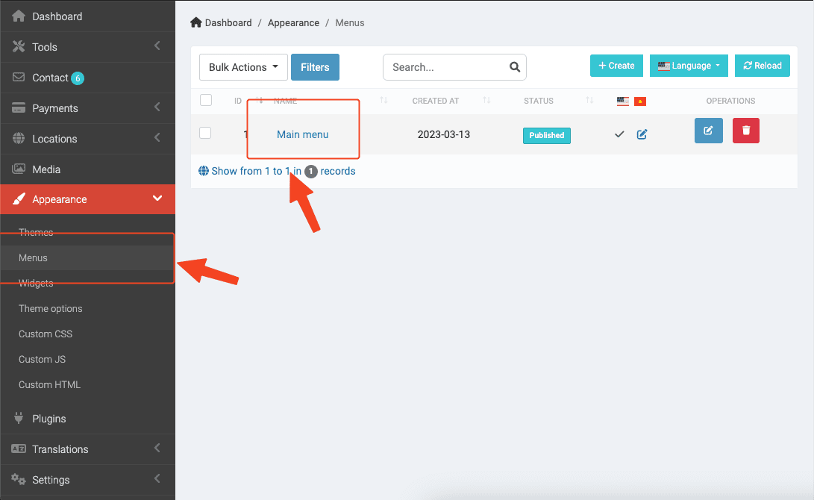
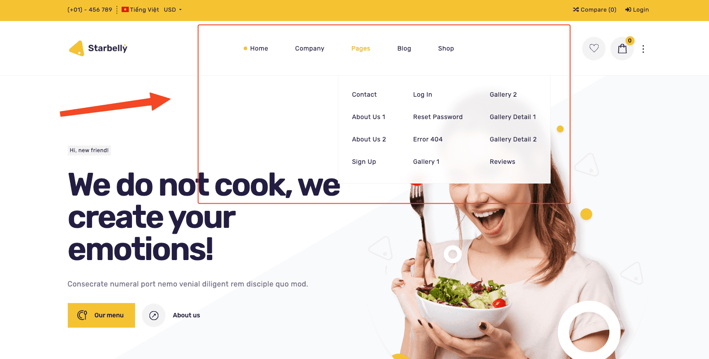
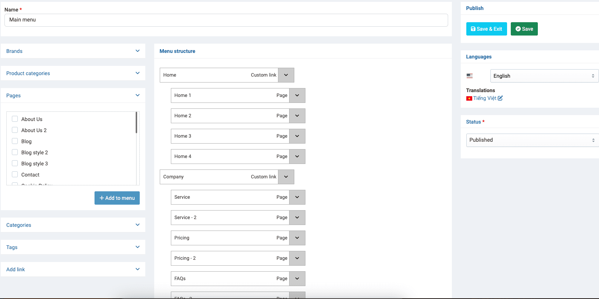

# Setup Menu

You can manage your menu from **Admin** -> **Appearance** -> **Menus**.

## Main menu

Main menu is the menu bar on the header, click **Edit** button on the `Main menu` row.

Edit and Save!
