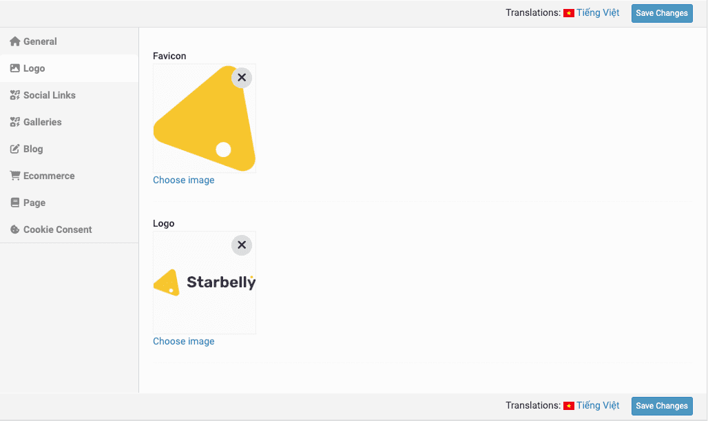

# Theme Options

**Theme options** is a place that users can customize their theme. These settings allow users to change the logo, colors, fonts, layout, and other aspects of the theme without needing to know how to code.

:::tip
Go to **Admin** -> **Appearance** -> **Theme options**.
:::

## General

In this **General** tab, there are have a lot of options to customize the site identity like title, description, seo, colors, font, theme mode, ...

## Home page

To set a page as homepage, go to the **Page** tab.

## Ecommerce

At here, you can set the items per page, style of items (3 items on a row or 4 items on a row).

## Logo & Favicon

## Social Links

Social links is the list of the socials that appear in the footer of the page. In this tab, you can add or remove the social links.

You can add socials links in the **Social Links** tab.

## Gallery

Gallery is a photo gallery, allow you to create and manage galleries of images, organize them into categories, and share them with others.

In the **Gallery**, you can edit the page title, description and even gallery style.

