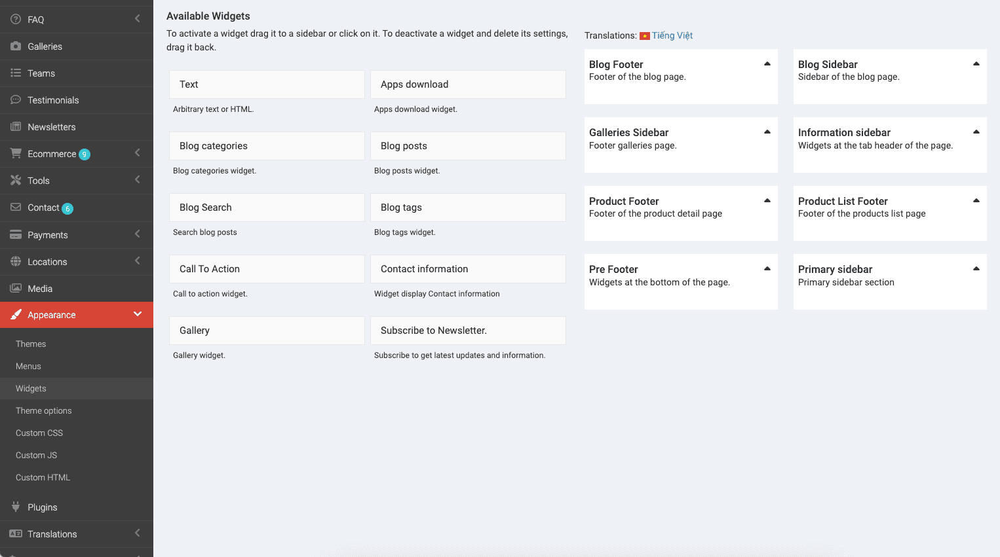
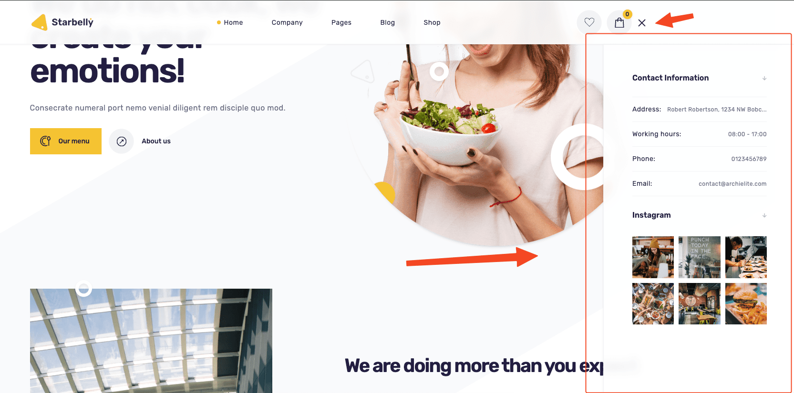
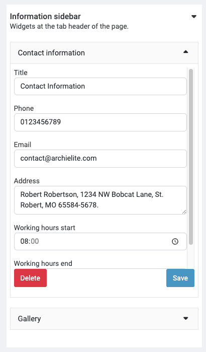
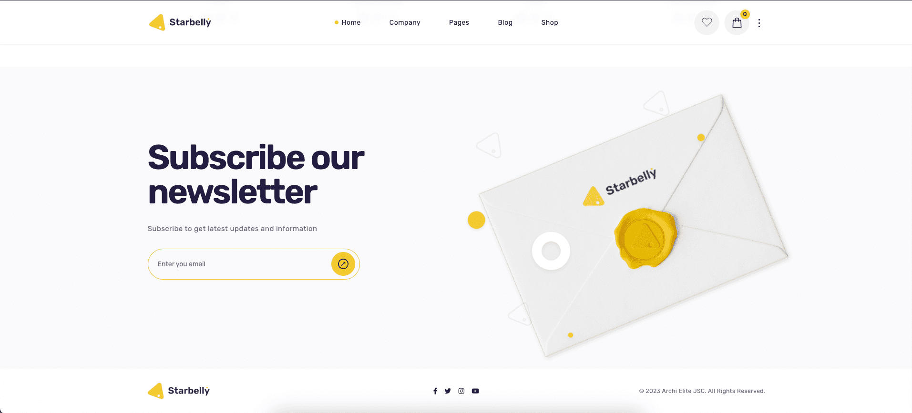
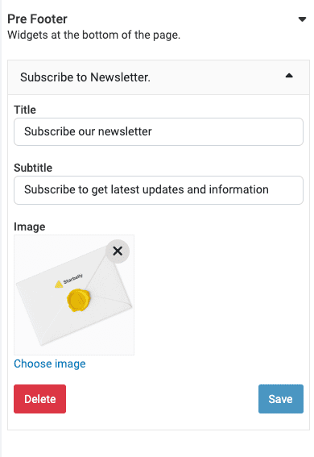

# Widgets

You can customize widgets in **Admin** -> **Appearance** -> **Widgets**.

## Information Sidebar

You can use the Contact **Information** and **Gallery** widgets for this sidebar.

## Pre Footer

Pre footer is the section that located on the footer section. **Newsletter** widget is the best choice for pre footer sidebar.

and there are still many other widgets waiting for you to discover.
